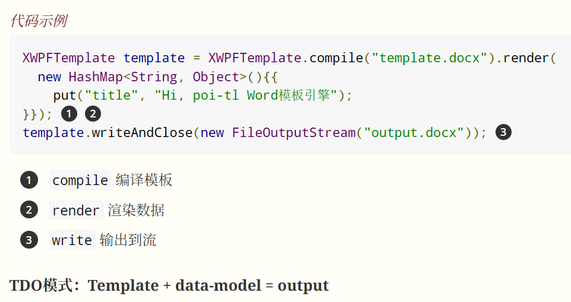

# Java操作Word实现自动化动态填表

本篇介绍如何在Spring Boot项目中，利用`poi-tl`库实现Word文档的自动化动态填表。

---

## 1. 项目环境准备

### 1.1 Spring Boot 父工程依赖
在`pom.xml`中添加Spring Boot父工程依赖：

```xml
<parent>
    <groupId>org.springframework.boot</groupId>
    <artifactId>spring-boot-starter-parent</artifactId>
    <version>2.7.13</version>
    <relativePath/> <!-- lookup parent from repository -->
</parent>
```

### 1.2 poi-tl依赖
poi-tl是基于POI的Word模板引擎，支持动态填充Word内容。

```xml
<dependency>
    <groupId>com.deepoove</groupId>
    <artifactId>poi-tl</artifactId>
    <version>1.12.2</version>
</dependency>
```

- 官网：[https://deepoove.com/poi-tl](https://deepoove.com/poi-tl)
- 文档：[https://deepoove.com/poi-tl/#/](https://deepoove.com/poi-tl/#/)

---

## 2. 使用场景

- 批量生成合同、协议等标准化文档
- 动态填充简历、报告、通知等
- 自动化办公系统集成

---

## 3. 代码示例

假设有如下Word模板（以{{}}包裹变量）：

> 例如：`姓名：{{name}}  年龄：{{age}}  部门：{{department}}`

Java代码实现：



```java
// 伪代码示例
Map<String, Object> data = new HashMap<>();
data.put("name", "张三");
data.put("age", 28);
data.put("department", "技术部");

XWPFTemplate template = XWPFTemplate.compile("template.docx").render(data);
template.writeAndClose(new FileOutputStream("output.docx"));
```

### 代码说明
- `XWPFTemplate.compile()`：加载Word模板
- `render(data)`：渲染数据到模板
- `writeAndClose()`：输出生成的新文档

---

## 4. 更多参考
- [poi-tl官方文档](https://deepoove.com/poi-tl/#/)
- [GitHub示例项目](https://github.com/Sayi/poi-tl)

如需详细代码或模板示例，可参考官方文档或留言交流。


## 源码
源码位于case01，可以移步查看。
