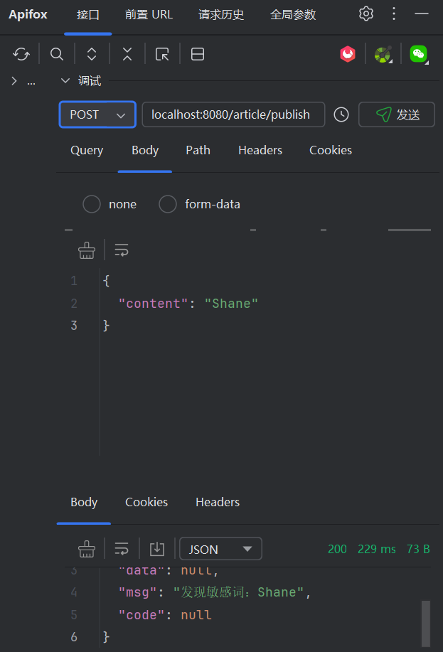

# 超好用的责任链模式优化代码

## 1. 需求分析

在实际业务开发中，文章上传接口往往需要进行多项校验，例如：
- 文章内容不能超过 10000 字
- 不能包含敏感词
- 其他自定义校验（如标题不能为空、作者信息校验等）

如果将所有校验逻辑耦合在一起，代码会变得臃肿且难以维护。为了解决这一问题，我们可以采用**责任链模式**，让每个校验独立成链，灵活扩展和调整顺序。

---

## 2. 传统写法的弊端

传统写法通常如下：

```java
public void publish(Article article) {
    if (article.getContent().length() > 10000) {
        throw new Exception("内容过长");
    }
    if (containsSensitiveWords(article.getContent())) {
        throw new Exception("包含敏感词");
    }
    // 其他校验...
    // 业务逻辑
}
```

- 校验逻辑全部耦合在一起，顺序难以调整
- 新增/修改校验需频繁修改主流程代码
- 可读性、可维护性差

---

## 3. 责任链模式优化方案

### 3.1 设计思路

1. **定义校验接口 `IArticlePublishCheck`**  
   包含两个核心方法：`check()`（执行校验）和 `setNext()`（设置下一个校验节点）。

2. **抽象类 `AbstractCheck`**  
   封装公共逻辑，持有下一个校验节点引用，定义模板方法，子类只需实现具体校验逻辑。

3. **具体校验实现类**  
   如 `ContentLengthCheck`、`SensitiveWordsCheck`，分别实现各自的校验规则。

4. **责任链组装配置类 `ArticleCheckConfig`**  
   负责将各个校验节点按需组装成链，并注册为 Spring Bean。

5. **服务层 `ArticleService`**  
   注入责任链首节点，调用 `check()` 方法自动完成所有校验。

6. **控制器层 `ArticleController`**  
   提供文章发布接口，调用服务层方法。

### 3.2 代码结构

- `IArticlePublishCheck`：责任链接口
- `AbstractCheck`：抽象校验节点
- `ContentLengthCheck`、`SensitiveWordsCheck`：具体校验实现
- `ArticleCheckConfig`：责任链组装
- `ArticleService`：业务服务
- `ArticleController`：接口控制器

---

## 4. 代码实现（简要示例）

### 4.1 责任链接口

```java
public interface IArticlePublishCheck {
    void check(ArticlePublishRequest request);
    IArticlePublishCheck setNext(IArticlePublishCheck next);
}
```

### 4.2 抽象校验节点

```java
public abstract class AbstractCheck implements IArticlePublishCheck {
    private IArticlePublishCheck next;

    @Override
    public IArticlePublishCheck setNext(IArticlePublishCheck next) {
        this.next = next;
        return next;
    }

    @Override
    public void check(ArticlePublishRequest request) {
        checkIn(request);
        if (next != null) {
            next.check(request);
        }
    }

    protected abstract void checkIn(ArticlePublishRequest request);
}
```

### 4.3 具体校验实现

以内容长度校验为例：

```java
@Component
public class ContentLengthCheck extends AbstractCheck {
    @Override
    protected void checkIn(ArticlePublishRequest request) {
        if (request.getContent().length() > 10000) {
            throw new BusinessException("内容不能超过10000字");
        }
    }
}
```

### 4.4 责任链组装

```java
@Configuration
public class ArticleCheckConfig {
    @Bean
    public IArticlePublishCheck articlePublishCheck(ContentLengthCheck lengthCheck, SensitiveWordsCheck sensitiveCheck) {
        lengthCheck.setNext(sensitiveCheck);
        return lengthCheck;
    }
}
```

---

## 5. 测试效果

- 支持灵活扩展、调整校验顺序
- 新增校验只需实现新节点并在配置类中组装
- 代码结构清晰，易于维护

测试敏感词校验成功：



---

## 6. 源码位置

完整源码见 `case02` 目录。

---

如需详细代码或有其他问题，欢迎留言交流！
