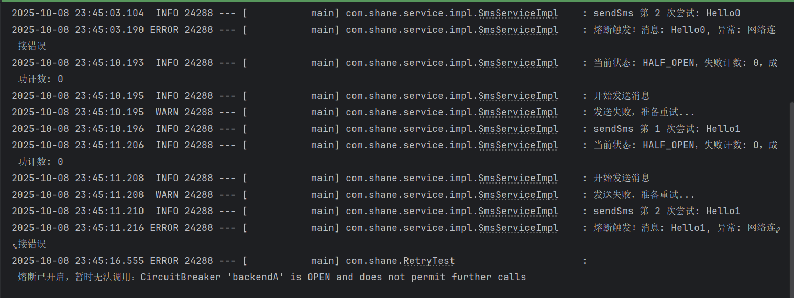

# Spring Retry 以及降级熔断注解实现

在实际开发中，重试和熔断是保障服务稳定性的重要手段。手动实现重试机制不仅增加代码复杂度，还容易引发高并发下的流量尖峰，导致 CPU 负载过高甚至服务雪崩。此外，并非所有异常都需要重试，部分非法参数导致的异常重试只会浪费资源。因此，推荐使用 Spring 提供的 Retry 机制和 Resilience4j 熔断组件，通过注解方式实现高效、完善的容错机制。

## 一、Spring Retry 注解实现重试

Spring Retry 提供了 `@Retryable` 注解，可以非常方便地为方法添加重试功能。例如：

```java
@Service
public interface SmsService {
    /**
     * 发送业务消息
     * @param msg 消息内容
     */
    @Retryable
    void sendSms(String msg);
}
```

- 未指定异常类型时，所有异常都会触发重试。
- 达到最大重试次数后仍失败，会抛出 `ExhaustedRetryException`。
- 默认最多重试 3 次，每次间隔 1 秒。

## 二、Resilience4j 实现熔断降级

相比 Sentinel，Resilience4j 更轻量，适合 Spring Boot 项目。引入依赖如下：

```xml
<!-- https://mvnrepository.com/artifact/io.github.resilience4j/resilience4j-spring-boot2 -->
<dependency>
    <groupId>io.github.resilience4j</groupId>
    <artifactId>resilience4j-spring-boot2</artifactId>
    <version>1.7.1</version>
</dependency>
```

熔断机制示意图如下：



---

如需更详细的代码示例或配置说明，可进一步补充。
